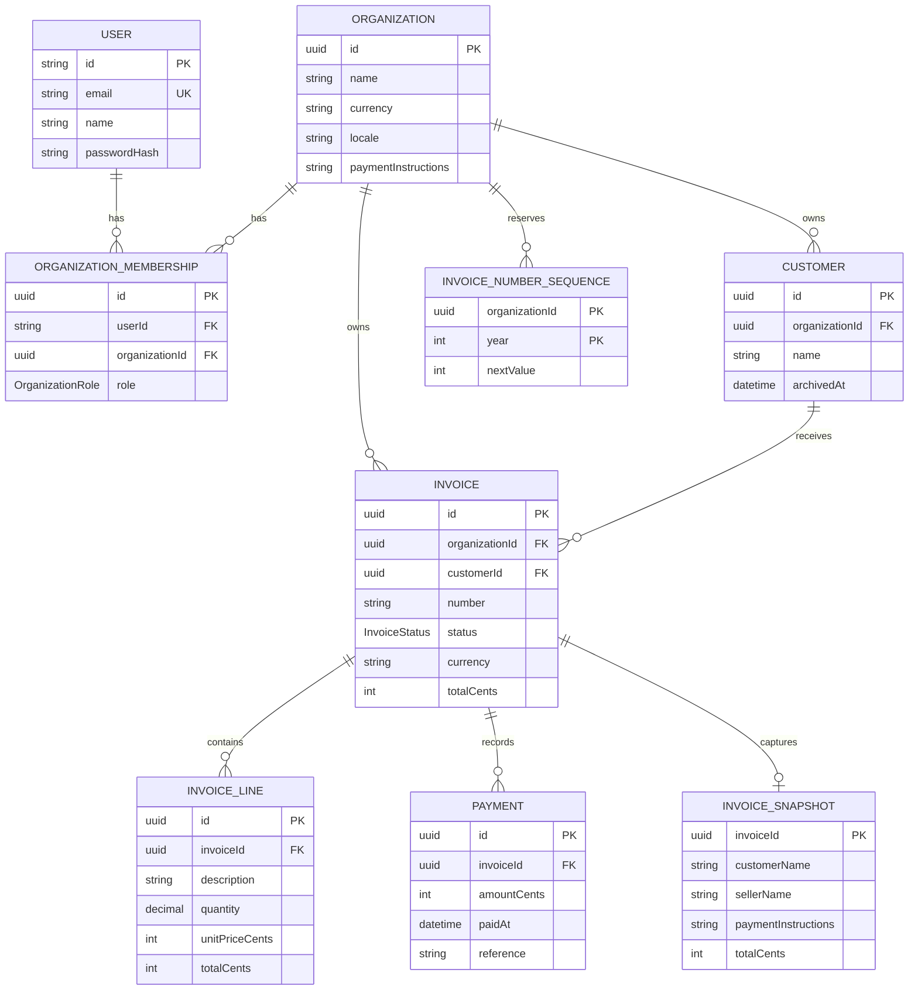

# Domain Map

Notes:

- Users belong to organizations through `OrganizationMembership`; the membership row stores the user's organization role.
- Customers, invoices, and invoice number sequences are scoped to an organization.
- An invoice belongs to one customer and one organization, has many lines and payments, and may have one immutable snapshot.
- `InvoiceSnapshot` is one-to-one with `Invoice` and uses `invoiceId` as its primary key.
