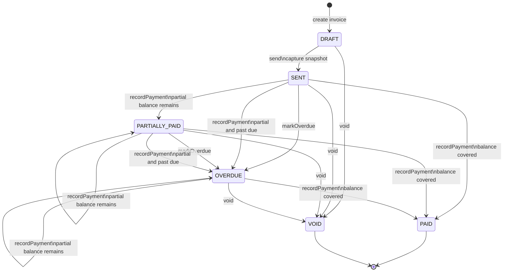

# Invoice Lifecycle

Notes:

- Only `DRAFT` invoices are editable.
- The `send` action is only allowed from `DRAFT` and captures an immutable `InvoiceSnapshot` before setting the invoice to `SENT`.
- Payments are only accepted for `SENT`, `PARTIALLY_PAID`, and `OVERDUE` invoices.
- Payment recording rejects overpayments and invoices whose existing payments already cover the total.
- `PAID` and `VOID` are terminal states with no further status actions.
