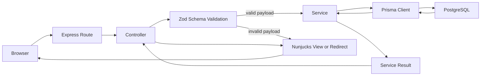

# Request Flow

Notes:

- Express routes map URLs to controller handlers and are mounted after authentication middleware for protected app areas.
- Controllers handle HTTP concerns: reading params and bodies, invoking schemas and services, setting flash messages, rendering views, and issuing redirects.
- Zod schemas validate and normalize form payloads before service calls.
- Services hold business rules and Prisma persistence logic, including organization scoping, invoice status rules, snapshots, and payments.
- Prisma is the app's database boundary for PostgreSQL.
- Nunjucks renders server-side HTML views; successful POST actions generally redirect with flash messages, while validation failures re-render the form with field errors.
